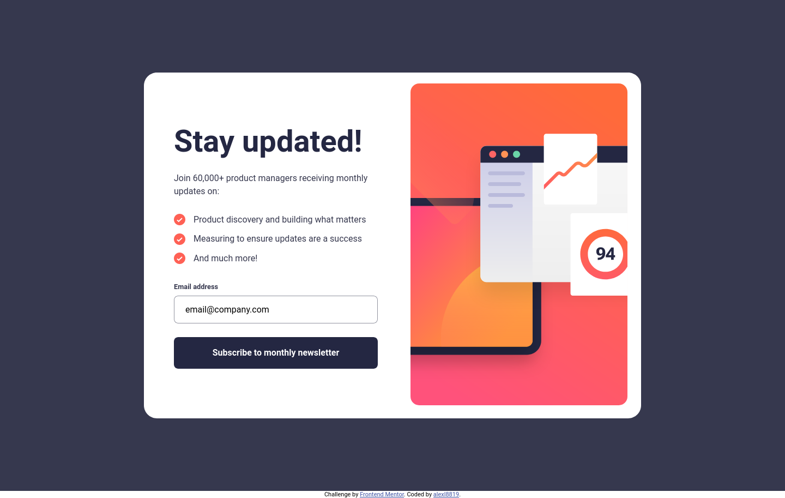
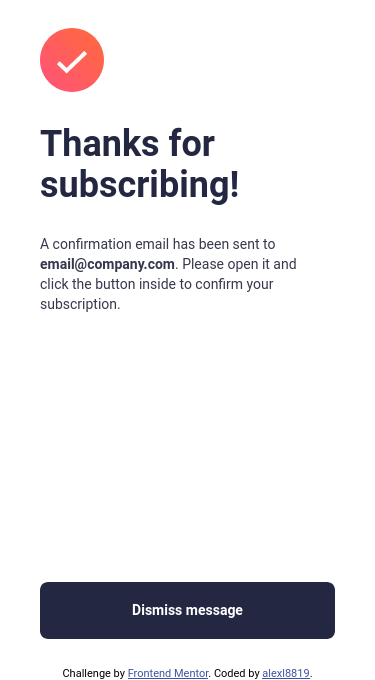

# Frontend Mentor - Newsletter sign-up form with success message solution

This is a solution to the [Newsletter sign-up form with success message challenge on Frontend Mentor](https://www.frontendmentor.io/challenges/newsletter-signup-form-with-success-message-3FC1AZbNrv). Frontend Mentor challenges help you improve your coding skills by building realistic projects. 

## Table of contents

- [Overview](#overview)
  - [The challenge](#the-challenge)
  - [Screenshot](#screenshot)
  - [Links](#links)
- [My process](#my-process)
  - [Built with](#built-with)
  - [What I learned](#what-i-learned)
  - [Continued development](#continued-development)
  - [Useful resources](#useful-resources)
- [Author](#author)

## Overview

### The challenge

Users should be able to:

- Add their email and submit the form
- See a success message with their email after successfully submitting the form
- See form validation messages if:
  - The field is left empty
  - The email address is not formatted correctly
- View the optimal layout for the interface depending on their device's screen size
- See hover and focus states for all interactive elements on the page

### Screenshot

### Links

- Live Site URL: [Newsletter Sign Up with Success Message](https://alexl8819.github.io/newsletter-sign-up-with-success-message/)

## My process

### Built with

- Semantic HTML5 markup
- CSS custom properties
- Flexbox
- CSS Grid
- Mobile-first workflow
- [Vue](https://vuejs.org/) - JS library
- [Vite](https://vitejs.dev/) - Tooling framework
- [Jest](https://jestjs.io/) - Testing framework
- [Vue Test Utils](https://test-utils.vuejs.org/) - Testing library for Vue3
- [ESlint](https://eslint.org/) - JS linting
- [Stylelint](https://stylelint.io/) - CSS linting

### What I learned

I hadn't used Vue for a while and decided to brush up and learn how to use and test Vue3 components. 

### Continued development

As always the focus is on clean, maintainable codebases alongside near-pixel perfect design. I am starting to get the hang of using the PerfectPixel plugin and have used it as a default going forward
with my projects. I have also began to write more descriptive git commits to make each commit more understandable. The next thing to work on would be committing small chunks instead of multiple chunks at once.

### Useful resources

- [Vue Utils Testing Guide](https://test-utils.vuejs.org/guide/) - Useful resources to learn about testing Vue3 components.

## Author

- Frontend Mentor - [@alexl8819](https://www.frontendmentor.io/profile/alexl8819)
